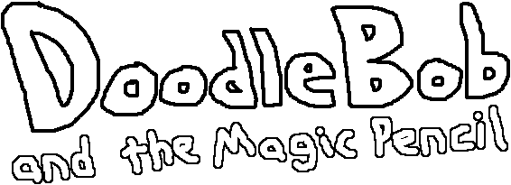

\
\
[PLEASE SUPPORT THE ORIGINAL GAME BY PLAYING IT FIRST!!!](https://gamejolt.com/games/dbdx/441954)
# Welcome!
​Plankton has harnessed the power of the Magic Pencil, creating an army of doodle minions and brainwashing SpongeBob's friends with four corrupted Special Doodles. In retaliation, SpongeBob revives his old nemesis, DoodleBob, who has now reformed. With the Magic Pencil as his only weapon, it's up to DoodleBob to stop Plan Z Version 186 and save SpongeBob's friends!

Yes, you heard right! This is the port of DoodleBob and the Magic Pencil. Not the DX version, because I only found [THIS](https://xpdev.itch.io/doodlebobdecompilation) decompilation so far.\
And yes, an ACTUAL PS3 Port, rather than a silly remakes, hiding in the "Edition" names. Ah!

Also this port is still upgrading, please wait...